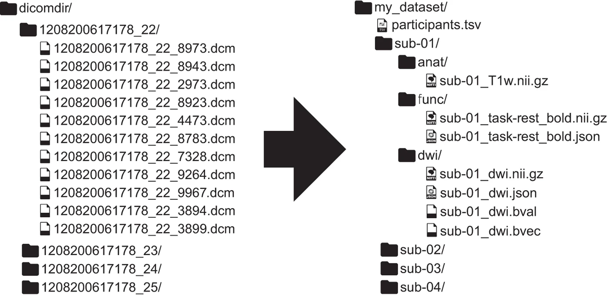
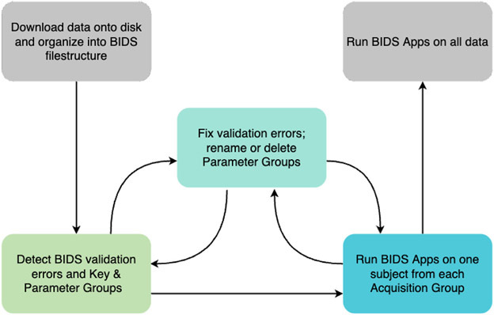

# BIDS

## What is BIDS?

When labs organize datasets in different ways time is often wasted rewriting scripts to expect a particular structure. [BIDS](https://bids.neuroimaging.io/standards/) solves this problem by standardizing the organization of neuroimaging data. 

A simple example of MRI data organization into BIDS format can be seen below. If unfamiliar, we recommend reading the detailed notes [here](https://bids.neuroimaging.io/getting_started/index.html).


[Source: Gorgolewski et al. 2016](https://www.nature.com/articles/sdata201644)

## DICOM Conversion

As you see in the example above, BIDS is nothing more than a prescribed directory structure and file naming convention, but it allows labs to more easily share datasets and processing pipelines, interact with the dataset programmatically via pybids, and run all the most popular neuroimaging tools ([“BIDS Apps”](https://bids.neuroimaging.io/tools/bids-apps.html)) in a consistent way.

### Custom-Code Using dcm2niix

It is possible to manually organize your NIFTIs into the BIDS structure in custom code, which sometimes may even be the only option if the original DICOMS are not available. Another case you may need to manually BIDS format is when partial meta data removal was applied to the DICOMs before sharing, which breaks the HeudiConv as it needs to read in certain meta-data (likely in cases where data is obtained from across multiple sites as per site regulations regarding sharing).

In these cases, [`dcm2niix`](https://github.com/rordenlab/dcm2niix) is the most straightforward option, which you can install on your device locally using the instructions at the source page on GitHub. 

On the PennSIVE cluster, you can just load `dcm2niix` using 

```bash
module load dcm2niix
```

Below is an example in bash to BIDS-format several subjects simultaneously on the cluster using `dcm2niix` command. 

Once you load the `dcm2niix` module, it is easy to set up the input (DICOMs) and output (NIFTIs) directories in bash and run the following for an example subject:

```bash
#!/bin/bash
module load dcm2niix

# convert to nifti within bids output directory
dcm2niix -o ~/outdir/ ~/dicomdir

```

**Customizing `dcm2niix` Output**

Note that unless you further customize this command line, you'll get an output file in the output directory named something like `output.nii`.

Luckily, the `dcm2niix` command provides several options that allow you to control output structure, file naming, and metadata generation. These are particularly useful when organizing outputs to align with BIDS conventions.

A few commonly used options include:

```bash
dcm2niix \
  -o /path/to/output_directory \        # specify output directory
  -f "%p_%s" \                          # customize filename pattern, e.g., "T1w"
  -b y \                                # generate BIDS-compatible JSON sidecars
  -z y \                                # compress output to .nii.gz
  -ba y \                               # anonymize metadata in JSON files
  /path/to/input_dicoms                 # specify input directory
  
```

Key options explained:

`-o`: Defines the output directory where NIfTI (and JSON) files will be saved. This should typically point to your BIDS rawdata/ structure.

`-f`: Controls the output filename format using variables (e.g., `%p` for protocol name, `%s` for series number). This is critical for aligning outputs with BIDS naming conventions before further renaming or scripting. Note that these do not correspond to BIDS entities like subject or session, so additional scripting is typically required to achieve full BIDS-compliant naming.

`-b y`: Essential and ensures that a .json sidecar file is created for each NIfTI file. These JSON files contain metadata required for BIDS compliance.

`-z y`: Compresses NIfTI files into .nii.gz, which is standard in BIDS datasets.

`-ba y`: Removes potentially identifying information from metadata fields in the JSON output.

Now, we can add some of these customization into the initial example above, and ensure properly BIDS-formatted conversions for all subjects/sessions.

```bash
#!/bin/bash
module load dcm2niix

# base directories
original_data="/project/${project_name}/original_data"
rawdata="/project/${project_name}/rawdata"

# example: loop over all subject folders in original_data
for subject_folder in ${original_data}/*; do
  [ -d "$subject_folder" ] || continue 
  
  # assign a BIDS-valid subject label from the raw folder name
  subject_id=$(basename "$subject_folder")
  subj="sub-${subject_id}"

  # example: loop over all visit/session folders within each subject folder
  for visit_folder in "$subject_folder"/*; do
    [ -d "$visit_folder" ] || continue

    # assign a BIDS-valid session label from the raw folder name
    visit_id=$(basename "$visit_folder")
    ses="ses-${visit_id}"

    # define BIDS-valid output folder
    outdir="${rawdata}/${subj}/${ses}/anat"
    mkdir -p "$outdir"

    # convert dicoms to nifti
    dcm2niix \
      -o "$outdir" \
      -f "%p_%s" \
      -b y \
      -z y \
      "$visit_folder"

    # the output from the previous step will keep the raw file name with a sub-#_ses-# prefix, which is not entirely BIDS-valid
    # we can write another loop to rename each image file (& it's .json) based on a string match. 
    # here is an example for renaming a T1-weighted scan:
    for f in "$outdir"/*.nii.gz; do
      [ -e "$f" ] || continue 

      # grab the file name
      base=$(basename "$f" .nii.gz)

      # check if the file name contains T1 or MPRAGE, if yes, edit the file name in BIDS-valid format: sub-#_ses-#_T1w.nii.gz 
      # Make sure to edit the .json file with the same file name in the same way!
      if [[ "$base" == *T1* || "$base" == *MPRAGE* ]]; then
        mv "$f" "${outdir}/${subj}_${ses}_T1w.nii.gz"
        mv "${outdir}/${base}.json" "${outdir}/${subj}_${ses}_T1w.json"
      fi
    done
  done
done

```

!!! note

    For more advanced customization (e.g., additional filename variables, merging slices, handling multi-echo data), refer to the official documentations:

    - [dcm2niix GitHub page](https://github.com/rordenlab/dcm2niix)
    
    - [Full help page (all command options)](https://github.com/rordenlab/dcm2niix#usage)
    
    - [BIDS specification (naming conventions)](https://bids.neuroimaging.io/)


### HeuDiConv

In most cases, it is recommended to use one of the many available [converters](https://bids.neuroimaging.io/tools/converters.html) to efficiently BIDS-format your data. 

Among these, [HeuDiConv](https://heudiconv.readthedocs.io/en/latest/) has become one of the most common tools and we recommend its use to automatically format the produced NIFTIs according to BIDS. 

Unlike `dcm2niix` which can simply be fed a directory of DICOMs, HeuDiConv requires a bit more setup. First, your DICOMs be organized either by StudyUID or accession_number. Then, you need to run heudiconv with the `-c none -f convertall` options to generate TSVs with DICOM metadata needed to write a heuristic.

For example,

```bash
heudiconv \
    -d "/path/to/data/{subject}/{session}/*.dcm" \
    -o /path/to/output \
    -f convertall \
    -s 001 -ss abc -c none -b -g accession_number
```

There will now be a hidden .heudiconv directory with DICOM header TSVs. Once you’ve determined which DICOMs go where, edit the heuristic template from the previous step ([read more about heuristic files here](https://heudiconv.readthedocs.io/en/latest/heuristics.html)), and then use the `-c dcm2niix` option to tell heudiconv to do the actual dcm2niix conversion. 

```bash
heudiconv \
    -d "/path/to/data/{subject}/{session}/*.dcm" \
    -o /path/to/output \
    -f /path/to/your_heuristic.py \
    -s 001 -ss abc -c dcm2niix -b -g accession_number
```

### PennSIVE BIDS pipeline

Lucky for us, PennSIVE has an in-house BIDS conversion pipeline, which utilizes the HeuDiConv converter. You can access and clone it from PennSIVE GitHub to your account on the cluster or your local device. [PennSIVE BIDS Pipeline](https://github.com/PennSIVE/PennSIVE_neuro_pip/tree/main/pipelines/bids). 

Further documentation and instructions regarding our BIDS Pipeline can also be found at [PennSIVE BIDS](pennsive_bids.md).

!!! note

    Before you go: Remember, it is always a good practice to BIDS-validate your data before running any post-processing/analysis pipelines or sharing with collaborators. Options for BIDS validation can be found [here](https://bids.neuroimaging.io/tools/validator.html). 


## BIDS Validation

It is always a good practice to validate your data is BIDS-compliant before moving into next steps of preprocessing and analysis. There are several tools available, below we summarize two.

### BIDS Validator
This is the official validator from the BIDS team; available in four formats:

- A web browser based version
- Command line version
- Docker based version
- A python library installable from pypi or conda-forge

Please refer to the [validator website](https://bids.neuroimaging.io/tools/validator.html) for brief tutorials on the web browser and command line versions, and additional links to the others. 

### CuBIDS (Curation of BIDS)

[CuBIDS](https://cubids.readthedocs.io/en/latest/) is a software package designed to facilitate reproducible curation of neuroimaging BIDS datasets. 

- CuBIDS facilitates the validation of BIDS data.

- CuBIDS visualizes and summarizes the heterogeneity in a BIDS dataset.

- CuBIDS helps users test pipelines on the entire parameter space of a BIDS dataset.

- CuBIDS allows users to perform metadata-based quality control on their BIDS data.

- CuBIDS helps users clean protected information in BIDS datasets, in order to prepare them for public sharing.


 

[Source: Covitz et al., 2022](https://pubmed.ncbi.nlm.nih.gov/36064140/)

