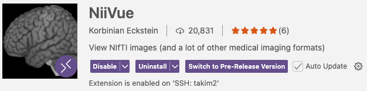
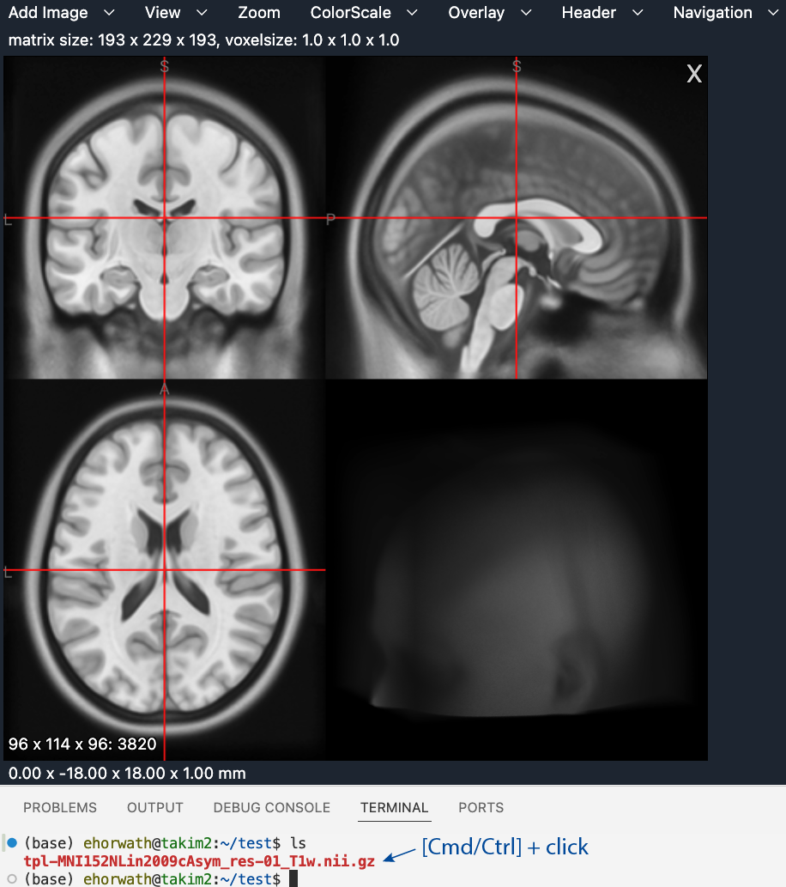
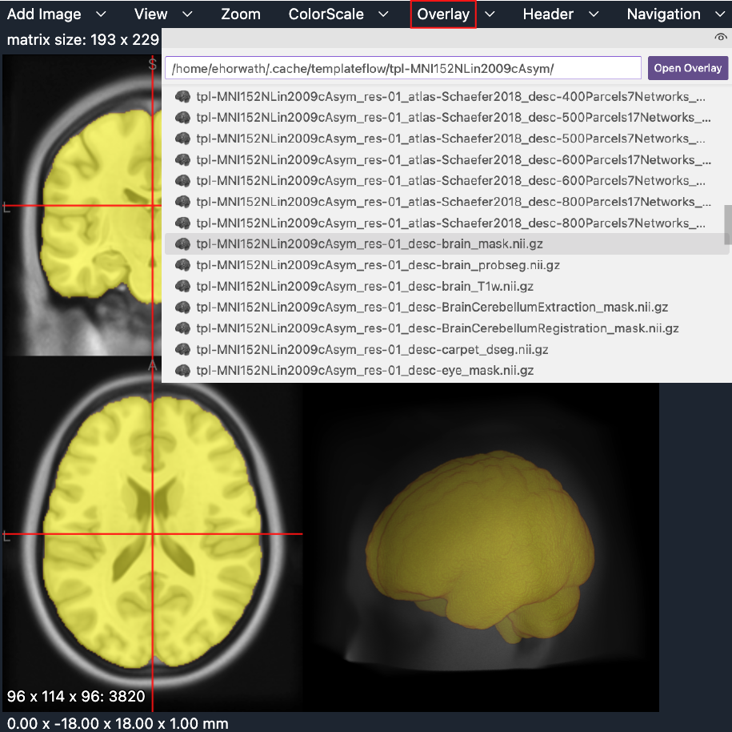

# Brain Visualization on Cluster

As we often run large image-processing jobs on the cluster, it can be useful to view images directly from the cluster file system rather than transferring them to a local computer first. However, viewing these images on the cluster is not as simple as viewing locally-stored images. This page describes a few options for viewing neuroimaging files stored on the cluster.

This is not intended to be a comprehensive list, but it covers three useful approaches:

  1. ITK-SNAP
  2. FSLeyes
  3. NiiVue
  
<br>

### Setup for ITK-SNAP and FSLeyes
Both ITK-SNAP and FSLeyes can be launched from the terminal. For images that are stored locally, you can simply point the software to the files you wish to view. For images that are stored on the cluster, you can run the software locally but point it to the remote files of interest. To view images stored on the cluster, you first need to mount a cluster directory locally using `sshfs`. 

First, create a local mount point. This only needs to be done once:
``` sh
mkdir -p <local-mount-path> # for example ~/cluster_mount
```

Then mount a cluster directory to that local mount point:
``` sh
sshfs <username@host>:/<cluster-path> <local-mount-path>
```

After mounting, files located in that cluster directory will appear under `<local-mount-path>` on your local computer.

If you ever need to unmount the directory, such as when changing the path or resetting the connection, try:
``` sh
umount -f <local-mount-path>
```

<br>

### Option 1: ITK-SNAP
To use this option, you must have ITK-SNAP installed on your local computer. You can download it from the ITK-SNAP website [here](https://www.itksnap.org/pmwiki/pmwiki.php?n=Downloads.SNAP4).

ITK-SNAP can load images directly from the terminal using the `itksnap` command. Some useful flags are:

<span style="font-family:menlo; color:black; font-size:16px;">-g</span>: main image (accepts one image)<br> 
<span style="font-family:menlo; color:black; font-size:16px;">-o</span>: overlay image (accepts one or more images)<br>
<span style="font-family:menlo; color:black; font-size:16px;">-s</span>: segmentation image (accepts one image)<br> 

After mounting a cluster directory locally in **Setup for ITK-SNAP and FSLeyes**:

``` sh
itksnap -g <local-mount-path>/<path-to-main-image> -o <local-mount-path>/<path-to-overlay-image> <local-mount-path>/<path-to-additional-overlay-image> -s <local-mount-path>/<path-to-segmentation-image>
```

<br>

For more information about using ITK-SNAP, see the following pages: <br>
[ITK-SNAP wiki](https://www.itksnap.org/pmwiki/pmwiki.php) <br>
[ITK-SNAP tutorial](https://www.itksnap.org/docs/viewtutorial.php)

<br>

### Option 2: FSLeyes
FSL must be installed on your local system to use this option. Instructions for download can be found [here](https://fsl.fmrib.ox.ac.uk/fsl/docs/install/index.html).

FSLeyes can also be launched directly from the terminal with the `fsleyes` command, through which you can load multiple images.

After mounting a cluster directory locally in **Setup for ITK-SNAP and FSLeyes**:

``` sh
fsleyes <local-mount-path>/<path-to-image> <local-mount-path>/<path-to-additional-image>
```

<br>

Checkout the pages below for more information about using FSLeyes: <br>
[FSLeyes user guide](https://open.oxcin.ox.ac.uk/pages/fsl/fsleyes/fsleyes/userdoc/) <br>
[FSLeyes documentation](https://fsl.fmrib.ox.ac.uk/fsl/docs/utilities/fsleyes.html)

<br>

### Option 3: NiiVue
If you use VSCode, you may be interested in checking out NiiVue. NiiVue is a simple software that allows for image viewing directly in VSCode. While ITK-SNAP or FSLeyes are often more flexible and easier to use with overlays, segmentations, and scripting batch visualization, this is a nice option for quick image viewing on the cluster.

To use it, you have to install the NiiVue extension in VSCode. 



<br>

Images can be viewed by clicking directly on a supported neuroimaging file through the VSCode Explorer panel or Terminal. 

{width=75%}

<br>

Once NiiVue has launched, the 'Add Image' menu can be used to view additional images side-by-side. Segmentations or overlays can be loaded through the 'Overlay' menu.

{width=75%}

<br>

More details can be found on the NiiVue extension page in VSCode or on their website: <br>
[NiiVue](https://niivue.com/)

Happy viewing!