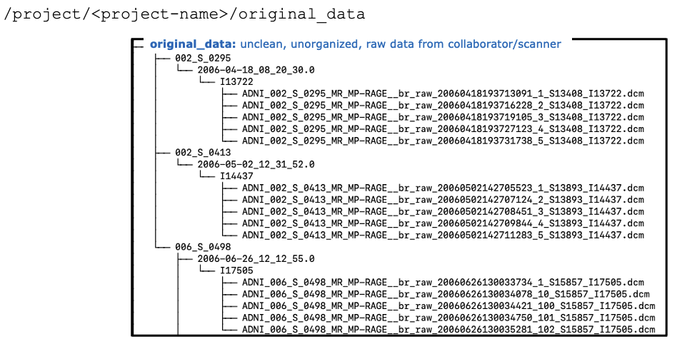
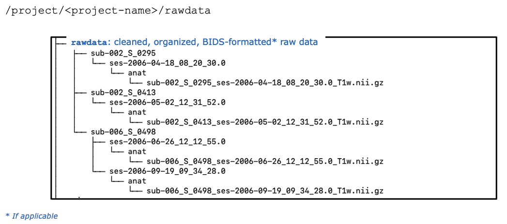
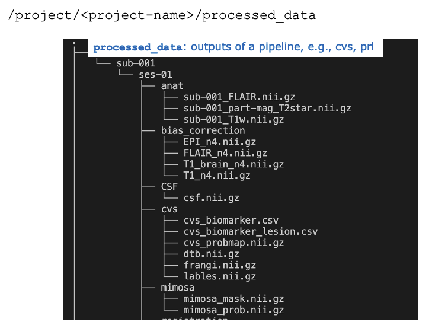
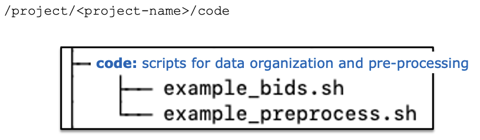
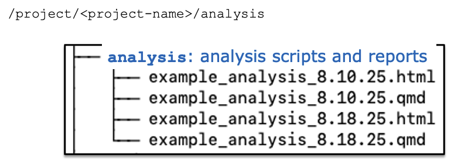

# Cluster Organization

PennSIVE has lots of project directories on the cluster. This page lays out guidelines for keeping our system organized to achieve consistency across projects and minimize unnecessary storage costs.

One of our main goals with this cluster organization system is to make sure anyone who may need to use the same datasets in the future, or help you with any future iterations of your work, can see and reproduce how the data was processed.

The first section applies to all project directories in `/project` that contain ***neuroimaging data***. The second section applies to ***simulation-based projects*** or projects using other data types.

 

!!! note
    **The data management team currently includes Büşra, Elizabeth, Ethan and Wendy.** For any questions about the processes outlined here, please feel free to reach out to any of the team members. Additionally, each project directory has been assigned to one of the team members to help with archiving **original_data** and **rawdata**. For questions about the contact person for a given project, or to assign a contact for new projects, please reach out to Ethan.

 

## Neuroimaging Projects

Below is key directory terminology:

| Directory name | Contents |
|----------------|:---------|
| original_data  | unclean, unorganized data; directly from collaborator or download |
| rawdata        | clean, organized (BIDS-formatted, if applicable) raw data |
| processed_data | outputs of any rawdata processing |

### Data Organization
#### original_data
At the start of a project, you will likely have unorganized, unclean, raw data. We will refer to this data as "original_data". The sole/main user of a project is responsible for adding their **original_data** to `/project/<project-name>/original_data` Below is an example:

#### rawdata
This **original_data** should then be cleaned and organized into the `/project/<project-name>/rawdata` directory. If applicable, this would include BIDS formatting. [Please see the BIDS page for reference]. See below for an example:

#### processed_data
Outputs from any processing of **rawdata** should be saved into `/project/<project-name>/processed_data`. See below for an example using a PennSIVE_neuro_pip pipeline:

!!! warning
    Once a clean, organized version of the **rawdata** is available, the project’s main user should notify their contact person in the data management team. The data management team will then:

    - Push the **original_data** (unorganized, unclean) from `/project/<project-name>/original_data directory` to Azure for archive 
    - Push the cleaned **rawdata** from `/project/<project-name>/rawdata` to `/project/rawdata/<project-name>` 
      - A copy of `/project/<project-name>/rawdata` will also be archived to Azure 

    Please note that once this archival process is complete, the data management team will remove both the **original_data** and **rawdata** directories from your `/project/<project-name>` directory. This means:

    - Your **original_data** will only be accessible by recovering from Azure. If you ever need to access your **original_data** again, the data management team can help with this 
    - Your **rawdata** will only be accessible from `/project/rawdata/<project-name>` 
    - Any processing of your **rawdata** in `/project/<project-name>/processed_data` will remain untouched by the data management team 
    - Any future processing of your **rawdata** will require setting your input data directory to `/project/rawdata/<project-name>`. The output should still be routed to `/project/<project-name>/processed_data` 
    - Any unique processing that would not need to be accessed by others or would interfere with the version of processing in `/project/<project-name>/processed_data` can be saved to a `/project/<project-name>/<user>` directory 

 

### Reproducibility
To help us achieve our goal of ensuring others are able to access, navigate, and reproduce any processing or analyses on your data, please ensure to complete the following steps as well.

#### README
For each project, please create a brief README file and include it within the main `/project/<project-name>` directory. It is up to you how much detail you’d like to include in this document, but as a general rule, please include the following:

- Overall project/dataset description
- File/directory descriptions if not obvious from name
- Pipelines used
- Important data collection/analysis dates
- Any other important details
- Point of contact

#### code
Any code used for cleaning, BIDS formatting, and processing of **original_data** and **rawdata** should be saved to `/project/<project-name>/code`. For example:

### Analysis
Any code used for post-processing **rawdata** or **processed_data**, as well as additional analysis code applied to the **processed_data**, should be saved to `/project/<project-name>/analysis`. For example:

#### writing (optional but recommended)
While up to the project owner, we recommend every project on the cluster to also have a `/project/<project-name>/writing` folder. This is where we’d love to keep manuscripts that are ready for submission, may be in revision, and/or already published in archives (e.g., bioRxiv) or journals. If you choose to have a writing folder, we also recommend keeping your publication-ready figures and tables in this directory as well (e.g., `/project/<project-name>/writing/figures`).

Alternatively, you could also add a line to the project’s `/project/<project-name>/README` file that has a publication date, journal & DOI.

That said, there is more flexibility as to where everyone would prefer to keep their initial drafts. Please feel free to use your own `/home/<user-name>` directory to organize your manuscripts.

 
 

## Simulation-based Projects

Sometimes a project may involve simulation studies where data is either purely synthetic or generated based on some real data. This could be more common for student projects. Unlike typical data analysis projects, the main goal of project management here is less for data sharing but more for reproducibility. We provide some suggestions below, but there is no one-size-fits-all organization approach, so feel free to adjust based on your own needs.

Before starting a simulation project, it is important to have a clear understanding of the research question and the simulation design. This will help guide the directory structure. Typically, a simulation study requires keeping track of the following types of folders and files, and each type could be organized into its own subdirectory within `/project/<simulation-project-name>/`:

| Folders & Files | Notes & Details |
|------|---------|
| `.Readme` | A text file that describes the project, including the research question, simulation design, and any other relevant information, as well as the structure of this directory. This file is critical to ensure that the project is well-documented and can be easily understood and reproduced by others. It should be updated as the project progresses. | 
| `log` | Typically `bsub` output files that contain key information about parameter setting as well as error messages should go under the `log/` folder. Useful for debugging and for keeping track of the simulation process. | 
| `simulated_data` | It is common to generate and save a large number of simulated datasets for method evaluation. This could be memory intensive, so it's especially important to save them in the `/project/<simulation-project-name>/` directory instead of your home directory. | 
| `results` | This could include direct outputs for each simulation and summary statistics, plots, and tables after all simulations are completed. | 
| `source_data` | Optional but recommended: for plasmode simulations, it is helpful to store the preprocessed source data ready to be used to generate the simulated data. | 

Each of the categories above can be further divided into subdirectories for each parameter setting or simulation run. Of course, you could also add more components based on the specific workflow, such as environments, packages, template data, etc. The key is to have a clear and organized structure that allows for easy navigation and reproducibility. 

Here are some key takeaways:

- Keep the directory structure simple and intuitive, with clear naming conventions. Document the structure in the `.Readme` file and keep it up-to-date.

- Clean up deprecated files frequently to avoid confusion and redundancy. It is good practice to remove log files and intermediate results that are no longer needed.

- Everyone has a different workflow and preferences for organizing files, so it is important to set up the directory in a way that you find most convenient and efficient!

 

**Thank you for your help in keeping our projects organized and reproducible!** Please reach out to the data management team for any questions or concerns.
