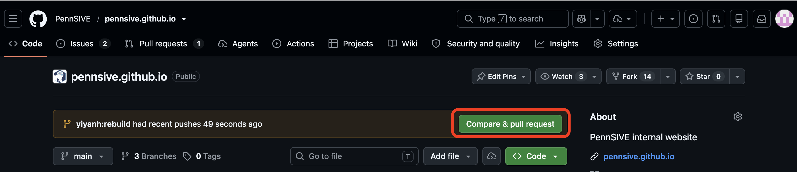
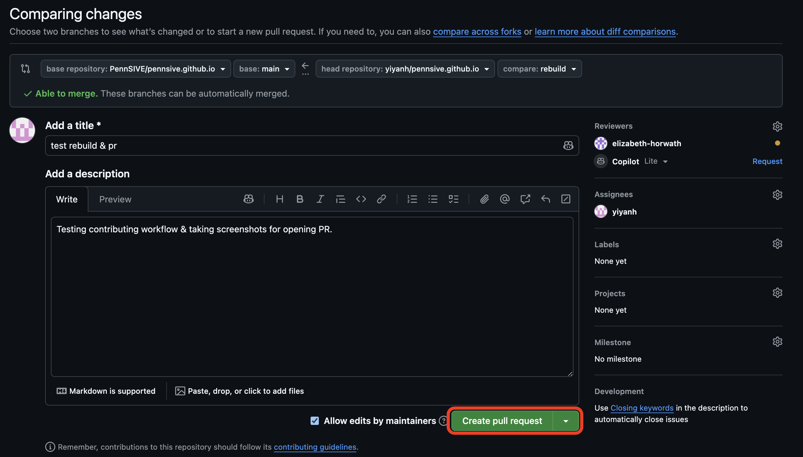
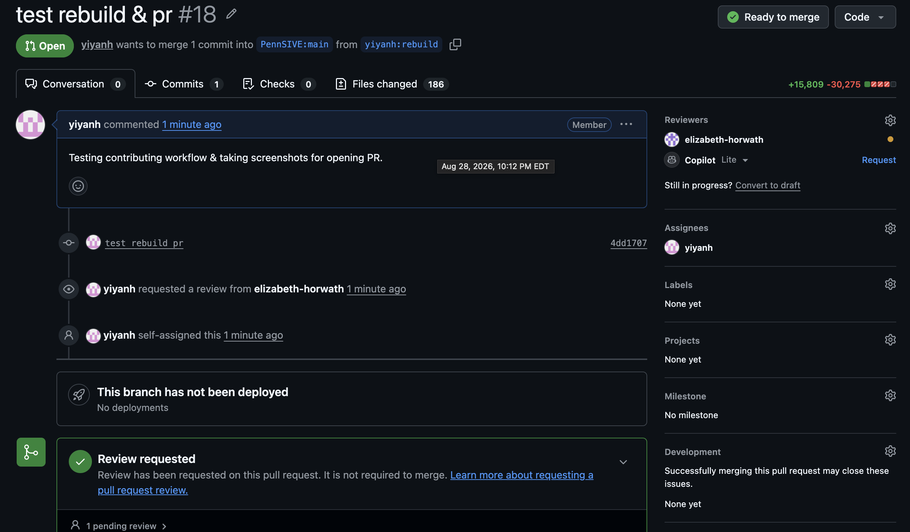
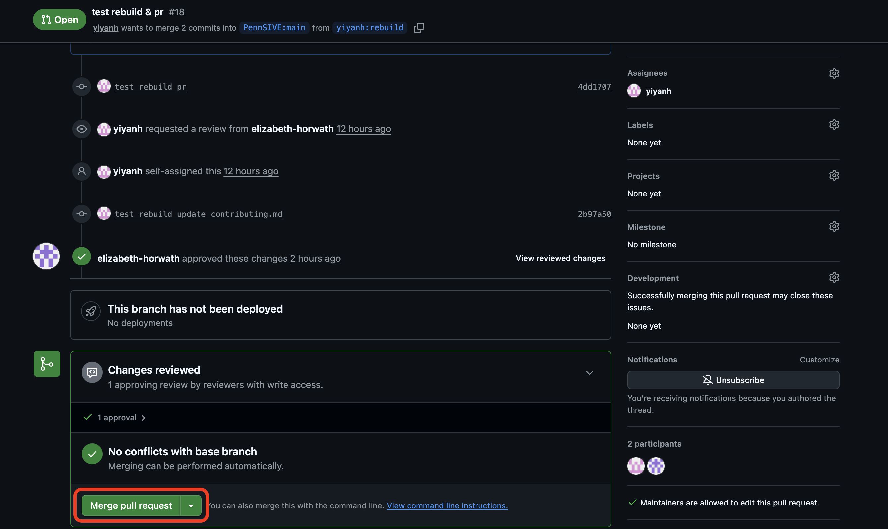

# Contributing to this Wiki

Thanks for considering a contribution! You'll need:

- A [GitHub account](https://github.com/join)
- [Git](https://git-scm.com/book/en/v2/Getting-Started-Installing-Git) installed
- [Zensical](https://zensical.org/) installed for local preview (`pip install zensical`, or use a conda environment)
- Basic [Markdown syntax](https://docs.github.com/en/get-started/writing-on-github/getting-started-with-writing-and-formatting-on-github/basic-writing-and-formatting-syntax) knowledge

## 1. Fork and clone the repo

Fork [pennsive/pennsive.github.io](https://github.com/pennsive/pennsive.github.io) (button in the upper-right corner):


Then clone your fork:

```sh
git clone https://github.com/<your-username>/pennsive.github.io
cd pennsive.github.io
```

## 2. Track the upstream repo

```sh
git remote add upstream https://github.com/pennsive/pennsive.github.io.git
```

This lets you pull in changes made to the wiki after you forked it.

## 3. Create a branch

```sh
git checkout -b <descriptive-branch-name>
```

Don't work directly on `main` — it needs to stay in sync with `upstream`.

## 4. Write your page

Create a new file under `docs/`, named in lowercase with hyphens or underscores (e.g. `docs/my-topic.md`).

To keep every page consistent:

- **Start with a single `#` heading** for the page title. Use `##`/`###` below it in order, without skipping levels, to ensure consistent generation of table of contents.
- **Add author/date frontmatter** at the very top of the file:

    ```md
    ---
    author: "Your Name"
    date: yyyy-mm-dd
    ---
    ```

    Update the `date` whenever you make a substantial edit to an existing page.

- **Tag code blocks with a language**, e.g. ` ```sh `, ` ```python `, ` ```r `, ` ```yaml `. Don't use Quarto/knitr chunk syntax.
- **Put images in `docs/images/my-topic/`** and reference them with a relative path: ``.
- **Link to other wiki pages by their filename**: `[project setup guide](projects.md)`. Zensical resolves `.md` links to the right page automatically.
- Use admonitions for callouts if useful, paying attention to the indentation. For example:

    ```md
    !!! note
        This is a tip.
    ```

## 5. Add your page to the navigation and the Welcome page

Pages don't appear automatically. You will need to add an entry to the `nav` list in `zensical.toml`, under whichever top-level section it belongs to:

```toml
{ "Computing Basics" = [
  ...
  { "My Topic" = "my-topic.md" },
] },
```

Similarly, add a link to your page in the appropriate section of `docs/index.md` so that it appears on the Welcome page.

!!! important
    `docs/index.md` is written as raw HTML, not Markdown. Use a plain HTML link:

    ```html
    <li><a href="my-topic.md">My Topic</a></li>
    ```

## 6. Add your name and photo to the Welcome page

As an acknowledgment, we encourage you to add your name and photo to the contributors list in the Welcome page. To do so, first upload your photo to `docs/images/contributors/` and then open `docs/index.md`. Scroll to near the bottom of the file, and then add to the following section:


```md
<div class="contributors">
  <!-- existing contributors -->
  <!-- ... -->
  <div class="contributor" data-name="Your Name">
    
  </div>
  <!-- ... -->

</div>
```

Please insert your entry in alphabetical order by last name.

## 7. Preview locally

Activate the environment where you installed Zensical, and change the working directory to `pennsive.github.io`. Then, run:

```sh
zensical serve
```

or

```sh
./run.sh
```

Open `http://localhost:8000` using your web browser. Now, you can preview the website and check your page in both light and dark mode.

## 8. Commit and open a pull request (PR)

```sh
cd pennsive.github.io
git add .
git commit -m "Add page on <my-topic>"
git push origin <your-branch-name>
```

If `upstream/main` has moved on since you branched:

```sh
git fetch upstream main
git checkout main && git pull upstream main
git checkout <your-branch-name> && git merge main
```

Then open a pull request from your fork on GitHub:



Check that your branch is being compared against `pennsive/pennsive.github.io`'s `main`, describe your changes, and submit:



A maintainer will review your PR and may ask for changes. 



If you need to make changes, just commit and push to your branch again. The PR will update automatically.

After a maintainer approves your PR, you will be able to merge it into `main`:



## Congratulations

You've made a contribution to the PennSIVE wiki! We appreciate it :)
