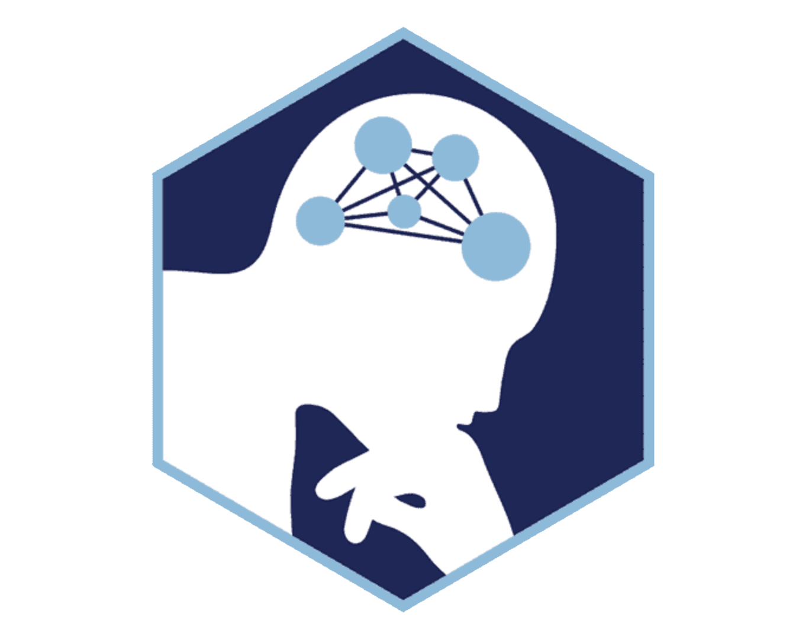
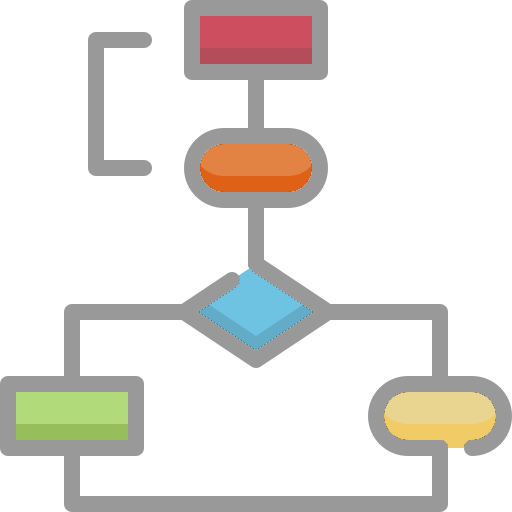

  
  <h1 class="hero-title">The PennSIVE Wiki</h1>
  

    Notes on lab admin, computing basics, PennSIVE pipelines,
    and anything else you might want to know.
    This is a living resource for all PennSIVE members — if you know something
    that's missing, add it!
  

---

# What would you like to learn about?

  

  

    
    <h3>Lab Admin</h3>
  

  
Onboarding, lab policies, and resources for new members

  <ul>
    <li><a href="onboarding.md">Onboarding</a></li>
    <li><a href="general_admin.md">General Admin</a></li>
    <li><a href="conference_travel.md">Conferences/Travel</a></li>
  </ul>
  

  

  

    
    <h3>Computing Basics</h3>
  

  
Introductions to cluster computing and related tools

  

    <ul>
      <li><a href="environment_setup.md">Bash, Cluster Environment, and Passwordless SSH Setup</a></li>
      <li><a href="bhosts_wiki.md">Hosts and Queues on the HPC Cluster</a></li>
      <li><a href="wiki-jobs.md">Submitting Jobs</a></li>
      <li><a href="cluster-screen.md">Using Screen on the Cluster</a></li>
      <li><a href="cluster_organization.md">Cluster Organization</a></li>
      <li><a href="programming_overview_wiki.md">R, Python, and Bash in Neuroimaging Analysis</a></li>
      <li><a href="containers.md">Containers</a></li>
      <li><a href="github.md">Git & GitHub Basics</a></li>
      <li><a href="wiki-ides.md">Using IDEs on the Cluster</a></li>
      <li><a href="brain_visualization.md">Brain Visualization on the Cluster</a></li>
      <li><a href="cluster_packages.md">Cluster Packages</a></li>
    </ul>
    

  

  

  

    
    <h3><a href="pennsive_pipelines.md" class="card-title-link">PennSIVE Pipelines/Software &rarr;</a></h3>
  

  
Neuroimaging pipelines and software

  

    <ul>
      <li><a href="pennsive_bids.md">PennSIVE BIDS</a></li>
      <li><a href="mimosa.md">MIMoSA</a></li>
      <li><a href="cvs.md">ACVS</a></li>
      <li><a href="aprl.md">APRL</a></li>
      <li><a href="alpaca.md">ALPaCA</a></li>
      <li><a href="lesion_count.md">Lesion Count</a></li>
      <li><a href="radiomic_feature.md">Radiomic Feature</a></li>
      <li><a href="t1t2.md">T1/T2</a></li>
      <li><a href="freesurfer.md">FreeSurfer</a></li>
      <li><a href="jlf.md">JLF</a></li>
      <li><a href="skullstripping.md">Skullstripping</a></li>
      <li><a href="brainqc.md">BrainQC</a></li>
    </ul>
  

  

  

  

    
    <h3>Additional Resources</h3>
  

  
Other useful neuroimaging and lab-related resources

  <ul>
    <li><a href="bids.md">BIDS</a></li>
    <li><a href="fmriprep.md">fMRIPrep</a></li>
    <li><a href="neurohacking.md">Neurohacking</a></li>
    <li><a href="surface_data_overview.md">Surface-based Neuroimaging Analyses</a></li>
    <li><a href="data-visualization-and-presentation-templates.md">Data Visualization Tools and Presentation Templates</a></li>
    <li><a href="project_management.md">Project Management Resources</a></li>
    <li><a href="personal_website.md">Building A Personal Website With GitHub Pages</a></li>
    <li><a href="other_resources.md">Other Helpful Resources</a></li>
  </ul>
  

 

---

# A Community Effort

Many thanks to all the contributors who helped build this resource!
 

  

    
  

  

    
  

  

    
  

  

    
  

  

    
  

  

    
  

  

    
  

  

    
  

  

    
  

  

We also thank all previous PennSIVE members who made prior versions of this wiki that we built upon :)

 

On behalf of the PennSIVE Wiki Group

  
Elizabeth Horwath

  
Yiyan Hao

  
Noah Hillman

  
Büşra Tanrıverdi

  
Quy Cao

