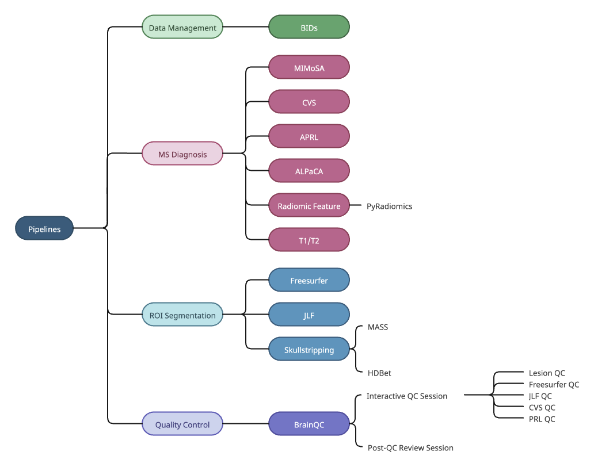

# PennSIVE NeuroPath

[PennSIVE NeuroPath](https://github.com/PennSIVE/PennSIVE_neuro_pip) contains multiple pipelines that were built in house to facilitate MRI data processing. The articles in this section will walk you through instructions and examples for using each of them. 

 

 

For each pipeline, usage instructions will be provided with dummy paths. Clicking the pipeline name will take you to the respective pipeline's GitHub page.

**To use the pipelines, you must first clone the GitHub repo** (`git clone https://github.com/PennSIVE/PennSIVE_neuro_pip.git`), as described on the PennSIVE NeuroPath home page.

<i>**Note**: Each of these pipelines were written in R with a variety of neuroimaging libraries (e.g., fslr, ANTsR, neurobase, etc.). For more details about general brain image processing resources, please see the bottom of this page.</i> 

## Instructions For Each Pipeline

[BIDS](pennsive_bids.md){ .pill }
[MIMoSA](mimosa.md){ .pill }
[CVS](cvs.md){ .pill }
[APRL](aprl.md){ .pill }
[ALPaCA](alpaca.md){ .pill }
[Lesion Count](lesion_count.md){ .pill }
[Radiomic Feature](radiomic_feature.md){ .pill }
[T1/T2](t1t2.md){ .pill }
[FreeSurfer](freesurfer.md){ .pill }
[JLF](jlf.md){ .pill }
[Skullstripping](skullstripping.md){ .pill }
[BrainQC](brainqc.md){ .pill }

## Neuroimaging Processing Resources

[FSL](https://fsl.fmrib.ox.ac.uk/fsl/docs/#/)  
[ANTs](https://github.com/ANTsX/ANTs)  
[FreeSurfer](https://surfer.nmr.mgh.harvard.edu/)  
[Andy's Brain Book](https://andysbrainbook.readthedocs.io/en/latest/index.html), although geared more towards fMRI processing, is a great resource. He provides in depth tutorials for using FSL, FreeSurfer, ANTs, SPM, and AFNI, among many other topics.