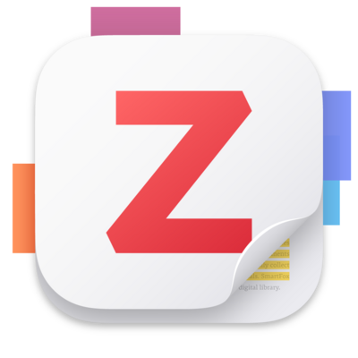

# Project Management Resources

## 1. Overview
This page introduces commonly used tools for managing research projects in PennSIVE, covering planning, reference management, collaborative writing, coding, and version control. These resources are designed to support organized workflows, reproducible research, and effective collaboration for both individual and team-based projects. Feel free to explore and choose the tools that best fit your working style.

---

## 2. Planning

### 2.1 Notion

[Notion](https://www.notion.so) is an all-in-one workspace for organizing tasks, notes, and project progress. In PennSIVE, we use a shared Notion workspace where staff document ongoing work and participate in collaborative discussions. It serves as a central hub to stay up to date on both individual and lab-wide projects.

To get started, sign up for a Notion account at [notion.so](https://www.notion.so) using your email address. Notion is available as a web app as well as desktop and mobile applications.

New lab members are encouraged to explore the existing workspace to get familiar with active projects. You can also use Notion templates to manage your own tasks, meeting notes, and project timelines. Notion has many features and can feel overwhelming at first, but the core functionality is straightforward and once comfortable, you can customize it to match your own workflow.

---

## 3. References and Writing

### 3.1 Zotero

[Zotero](https://www.zotero.org) is a free, open-source reference manager for collecting, organizing, and citing research literature. It supports importing references directly from the web via a browser extension, and can automatically retrieve metadata and PDFs for papers. Collections and tags help keep large libraries organized, and groups can be used to share references with collaborators.

Zotero integrates with Microsoft Word to insert in-text citations and generate bibliographies in any citation style. For a general overview of how to use this feature, this [video guide](https://www.youtube.com/watch?v=Tsrb8GoLcFE) walks through the workflow from start to finish.

### 3.2 Overleaf

[Overleaf](https://www.overleaf.com) is an online LaTeX editor designed for collaborative scientific writing. It compiles LaTeX documents in real time in the browser, so no local installation is required. Key features include version history, real-time collaboration with co-authors, a rich template library for journals and conference papers, and integration with reference managers like Zotero. Overleaf is particularly useful for manuscripts, reports, and any document that benefits from precise typesetting.

LaTeX can be code-intensive, especially for newcomers. The following cheatsheets are useful references to keep handy:

- [Learn LaTeX in 30 minutes](https://www.overleaf.com/learn/latex/Learn_LaTeX_in_30_minutes) This is a beginner-friendly tutorial that walks through the core concepts and syntax of LaTeX from scratch
- [LaTeX Cheatsheet](https://wch.github.io/latexsheet/latexsheet.pdf) This is a two-page reference covering math, formatting, tables, and more
- [Overleaf Documentation](https://www.overleaf.com/learn) This is a comprehensive guide with examples for nearly every use case
- [Detexify](https://detexify.kirelabs.org/classify.html) This is a handy tool for finding the LaTeX command for any symbol by drawing it

### 3.3 Microsoft Word

[Microsoft Word](https://www.microsoft.com/en-us/microsoft-365/word) is a standard word processor for drafting and editing documents, available through Penn's Microsoft 365 license. We are sure that you know this well.

---

## 4. Coding and Projects

### 4.1 R Projects

[R](https://www.r-project.org) is a programming language widely used for statistical computing and data analysis. To get started, install R and RStudio:

1. Download and install R from [CRAN](https://cran.r-project.org) by selecting your operating system and following the instructions.
2. Download and install [RStudio](https://posit.co/downloads/), which provides a user-friendly interface for working with R.

An R Project is a workflow feature in RStudio that organizes all files, scripts, and outputs for a given analysis into a single self-contained directory. Using R Projects helps ensure reproducibility by setting the working directory automatically and keeping file paths relative, which makes code easier to share and run on other machines.

To create a new R Project:

1. Open RStudio and go to **File → New Project**.
2. Choose **New Directory** to start from scratch, or **Existing Directory** to set up a project around files you already have.
3. Select **New Project**, give it a name, and choose where to save it on your computer.
4. Click **Create Project**. RStudio will open the new project with a `.Rproj` file in the directory.

It is recommended to create one R Project per analysis or paper, and to pair it with version control (see Section 5).

### 4.2 VS Code

[Visual Studio Code](https://code.visualstudio.com) (VS Code) is a lightweight, highly extensible code editor that supports a wide range of languages including Python, R, and shell scripting. It has a large ecosystem of extensions for debugging, Jupyter notebooks, remote development, and Git integration. VS Code's built-in terminal and source control panel make it a convenient single environment for both writing code and managing version history. It is available for free on Windows, macOS, and Linux.

To install VS Code:

1. Go to [code.visualstudio.com](https://code.visualstudio.com) and click **Download** for your operating system (Windows, macOS, or Linux).
2. Run the installer and follow the on-screen instructions. On Windows, it is recommended to check **Add to PATH** during installation so VS Code can be opened from the terminal.
3. Once installed, open VS Code and navigate to the **Extensions** panel (the square icon on the left sidebar, or `Ctrl+Shift+X` / `Cmd+Shift+X` on Mac).
4. Search for and install extensions relevant to your work.

---

## 5. Version Control

### 5.1 Git

[Git](https://git-scm.com) is the standard version control system for tracking changes to code and text files over time. It allows you to save snapshots of your work (commits), create branches to experiment without affecting the main codebase, and collaborate with others by merging contributions. For those new to Git, resources like [Happy Git with R](https://happygitwithr.com) provide a practical introduction tailored to the R and data science workflow.
