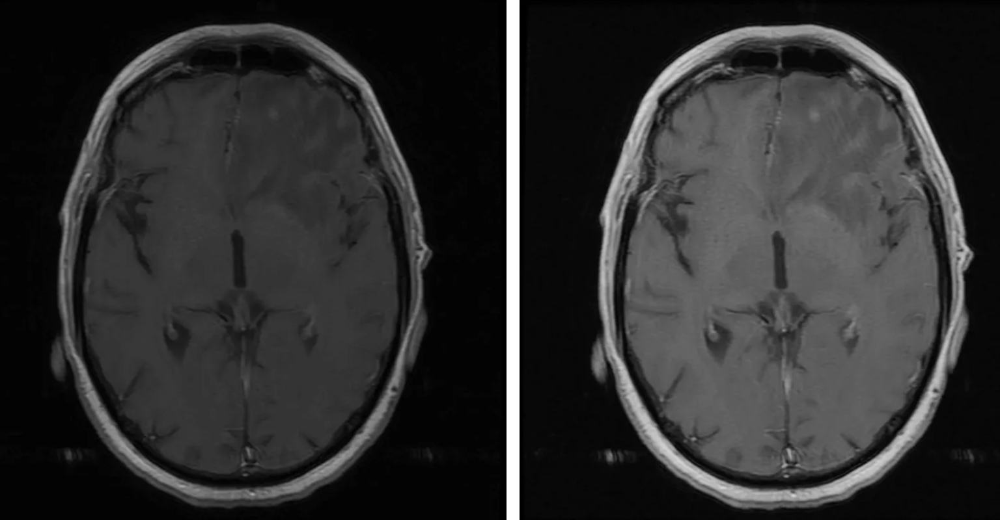

# Neurohacking
Created by: Gina Yu 

Last Updated: July 30,2026

Neurohacking, in the context of PennSIVE and computational neuroscience, refers to the use of computational tools to manipulate, process, and analyze neuroimaging data such as MRI scans. Within PennSIVE, these workflows are commonly taught using R.
This approach focuses on practical, reproducible workflows for working with brain imaging data, including reading image formats, performing preprocessing steps, and generating visualizations for analysis and interpretation.

[Neurohacking in R Coursera Course](https://www.coursera.org/learn/neurohacking)

The best way to learn about neurohacking in R is through the official Coursera course taught by instructors from Johns Hopkins from the link above. 
 
## Overview

Modern neurohacking workflows are centered around structural MRI data and commonly use standardized formats such as NIfTI. Using R and specialized packages, researchers can:

- Read and write brain imaging data  
- Explore and visualize brain structures  
- Perform preprocessing steps such as brain extraction and image correction  
- Align images across subjects or to standard templates  

These workflows allow us to manipulate raw imaging data to analyzable and interpretable outputs.

Common packages used throughout neurohacking workflows include packages from the `neuroconductor` and `neurobase` ecosystems, which provide tools for reading, processing, visualizing, and analyzing neuroimaging data.

## Core Components

### Neuroimaging Data

Neurohacking primarily works with MRI data, which captures structural information about the brain. These images are stored in formats like NIfTI, designed for efficient storage and analysis of multidimensional brain data.   

### Processing Pipelines

A typical neurohacking pipeline includes several key steps:

- **Inhomogeneity correction** – adjusting for intensity variations in MRI scans  
- **Brain extraction (skull stripping)** – isolating brain tissue from non-brain structures  
- **Image registration** – aligning images within or across subjects  
- **Segmentation** – identifying tissue types such as gray matter, white matter, and CSF 

These steps ensure that data are standardized and suitable for downstream analysis.

### Visualization

Visualization is a critical part of neurohacking. R provides tools to:

- Display 2D slices of brain images  
- Generate 3D brain visualizations  
- Map statistical results onto brain regions  

Visualization helps researchers interpret spatial patterns in neural data and communicate results effectively.

## Neurohacking in R

R is commonly used in neurohacking due to its strong ecosystem for data analysis and reproducibility. Neurohacking workflows in R typically involve:

- Loading neuroimaging data into R environments  
- Applying transformations and preprocessing steps  
- Using packages for visualization and statistical analysis  
- Creating reproducible scripts and pipelines  

## Applications

Neurohacking techniques are used in a range of research contexts, including:

- Studying brain structure and anatomy  
- Investigating neurological and psychiatric conditions  
- Developing and testing imaging pipelines  
- Visualizing brain-based statistical results  

By combining programming with neuroimaging, neurohacking enables more efficient and scalable analysis of complex brain data.

## Example of what you can do with Neurohacking! 

Here we have an image of a brain slice from an MRI scan that is a grayscale image with a black background at intensity = 0. 
This example demonstrates several common image preprocessing techniques. Starting from a raw MRI slice, intensity transformations can improve image contrast, while Gaussian smoothing reduces image noise and improves visualization. These preprocessing steps are commonly performed before downstream statistical analyses or image segmentation.
Then, smoothing can be utilized to "smooth" out the noise in the picture through techniques such as Gaussian smoothing. 

## Summary

Neurohacking represents the intersection of neuroscience, data science, and programming. By leveraging tools like R, researchers can process, analyze, and visualize brain imaging data in a reproducible and scalable way, forming the foundation for modern neuroimaging workflows.

For practical examples of running neuroimaging workflows on the PennSIVE computing environment, see the Cluster Computing and Data Visualization sections of this wiki.

## References
1. Image from Visualizing Brains Using R. Medium. [Website for image](https://medium.com/data-science/visualizing-brains-using-r-606fa0fb9fdf)

2. Coursera course for Neurohacking in R. [Neurohacking in R Coursera Course](https://www.coursera.org/learn/neurohacking)

